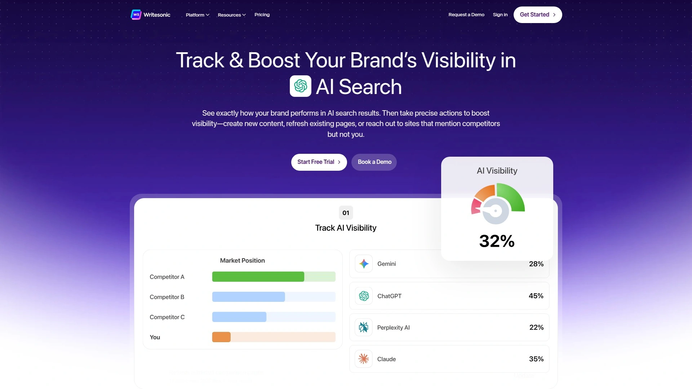
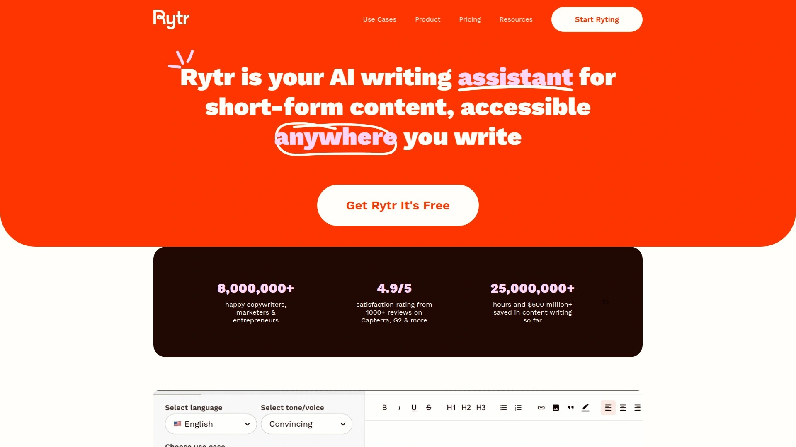
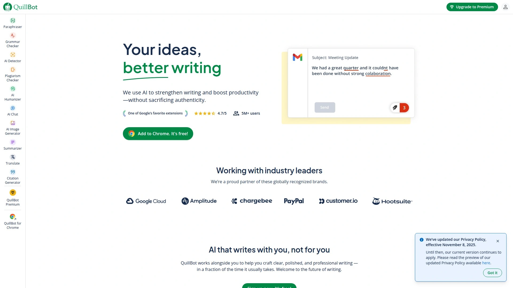

# 2025年排名前15的AI博客写作工具汇总(最新整理)

在内容为王的数字时代,博主和营销人员面临着持续产出高质量文章、优化SEO关键词、保持写作效率的三重挑战。传统的手工创作模式耗时长、成本高,难以满足快速增长的内容需求。AI写作工具通过自然语言处理技术,能在数分钟内生成SEO友好的完整文章、自动进行语法检查、提供内容优化建议,帮助创作者将工作效率提升5-10倍。本文精选15款经过市场验证的AI内容创作平台,覆盖从免费入门到企业级解决方案的全方位需求,助您找到最适合自己的智能写作助手。

## **[RightBlogger](https://rightblogger.com)**

专为博主打造的80+工具集成创作平台

RightBlogger是由资深博主开发的全方位AI写作生态系统,集成超过80种专业工具,特别适合需要高频产出SEO优化内容的个人博主和小型内容团队。平台最大亮点在于其无需复杂提示词的智能对话系统,用户可以用自然语言直接与AI沟通创作需求,显著降低学习门槛。

**核心功能矩阵**包括Article Writer文章生成器,可根据关键词一键创建完整的SEO优化长文;Video to Blog Post工具能将YouTube视频或音频录制自动转换为结构化博客文章,解决多媒体内容再利用难题。Smart Suggest功能基于网站现有内容智能推荐长尾关键词创意,帮助博主发现未被挖掘的流量机会。

内置的AI SEO编辑器提供实时优化建议,自动生成元标题、元描述、永久链接和主关键词等SEO要素,无需在多个工具间切换。独特的嵌入式AI工具生成器允许博主创建定制化互动工具(如计算器、名称生成器),并通过邮件捕获功能自动转化访客为订阅用户,实现内容营销闭环。

编辑界面支持高亮文本后一键调用AI进行改写、扩展或压缩,Chat功能可对已生成文章进行全局调整如改变语气或风格。Chrome浏览器扩展让用户在任何网页上直接使用写作工具和SEO分析功能。定价透明合理,提供免费基础版和无限制付费版,后者包含所有高级工具和无限生成次数。

## **[Jasper AI](https://www.jasper.ai)**

企业级品牌内容创作领导者

Jasper是市场占有率最高的AI写作平台之一,服务全球数万家企业客户,特别擅长保持品牌声音一致性和多场景营销文案创作。平台提供50+内容模板,覆盖博客文章、广告文案、社交媒体、电子邮件等全营销渠道。

**品牌声音定制**是Jasper的核心竞争力,系统可学习企业独特的写作风格和术语偏好,确保AI生成的所有内容都符合品牌调性。长文编辑器支持协同创作,团队成员可实时查看和编辑同一文档,适合内容量大的企业环境。

集成生态丰富,与Surfer SEO等主流工具深度对接实现内容优化,支持多语言生成满足全球化运营需求。Solutions Partner计划面向代理商和咨询公司,提供技术支持和业务赋能。定价采用订阅制,起步计划适合小团队,Business方案提供无限字数和高级功能。

## **[Writesonic](https://writesonic.com)**

SEO驱动的全栈内容营销平台

Writesonic将AI写作、图像生成、聊天机器人构建整合为统一平台,特别适合重视搜索引擎排名的营销人员和SEO专家。原生集成Surfer SEO实现关键词优化和内容评分的实时反馈。

**AI Article Writer**针对长文博客优化,可自动研究主题、生成大纲、撰写正文并插入相关性强的内部链接建议。70+模板库涵盖产品描述、广告创意、落地页文案等多元场景,单一工具解决多种内容需求。

内置AI图像生成器消除对第三方素材库的依赖,文字和视觉内容在同一工作流完成。多语言支持让非英语市场的创作者也能享受AI加速。定价层级清晰,从个人博主到企业团队都有对应方案,年付享受大幅折扣。

## **[Copy.ai](https://www.copy.ai)**

快速创意生成的敏捷写作工具

Copy.ai专注于短文案和创意灵感生成,以极快的响应速度和简洁界面赢得营销人员青睐。90+模板设计帮助用户在几秒内产出吸引眼球的标题、社交媒体文案和广告语。

**Noteboard功能**提供头脑风暴空间,用户可随时记录灵感并让AI扩展为完整内容片段。实时编辑和改写建议让文案迭代更加流畅,无需离开编辑界面。

免费计划包含基础功能适合预算有限的个人用户尝试,付费版解锁更多模板和生成次数。虽然不如专业长文工具适合深度文章创作,但在快节奏营销活动中展现出色的灵活性。

## **[Frase](https://frase.io)**

内容研究与SEO优化一体化方案

Frase将竞品分析、内容简报生成、AI写作、实时SEO评分融为一体,特别适合数据驱动型的内容策略师。核心优势是自动化的SERP分析功能,系统抓取目标关键词排名前20的页面,提取共性主题和问题。

**问题研究模块**聚合用户在搜索引擎中的真实提问,帮助创作者精准匹配用户意图。实时SEO评分基于竞品对标,明确指出内容需要补充的关键词和话题维度。

与Google Search Console集成实现关键词追踪和效果监测。虽然纯写作能力不及专注型工具强大,但在内容规划和优化环节节省的时间极为可观。月费起价45美元,提供7天免费试用。

## **[Grammarly](https://www.grammarly.com)**

AI驱动的全场景写作助手

Grammarly从语法检查工具进化为全能AI写作伙伴,每月服务超过3000万用户。除了基础的拼写纠错,平台现在提供语气调整、清晰度优化、可读性增强等高级功能。

**GrammarlyGO生成式AI**能根据简短提示创建邮件草稿、改写段落或扩展观点,同时保持用户的个人写作风格。浏览器插件、桌面应用和移动端全覆盖,在Gmail、Google Docs、社交媒体等任何写作场景实时工作。

商业版支持团队风格指南定制,确保公司文档语言一致性。免费版已覆盖基本语法检查,Premium和Business计划解锁更多智能建议。90天Cookie窗口期显著提高转化追踪准确度。

## **[Surfer SEO](https://surferseo.com)**

数据导向的内容优化专家

Surfer SEO虽非纯粹的AI写作工具,但其内容编辑器和关键词研究能力使其成为博主SEO工具箱的核心组件。通过分析数百个排名因素,Surfer提供精确到段落级别的优化建议。

**内容编辑器**实时显示当前文章与竞品的差距,包括关键词密度、标题结构、文章长度等维度。AI Outline生成器自动创建SEO友好的文章结构,减少规划时间。

与Jasper、Writesonic等主流AI写作工具集成,形成"AI创作+SEO优化"的完整工作流。SERP分析器帮助识别低竞争高流量的关键词机会。月费从89美元起,适合认真对待SEO的专业博主。

## **[Rytr](https://rytr.me)**

高性价比的多语言写作平台

Rytr以极具竞争力的定价和40+使用场景赢得预算敏感型用户的喜爱。支持30种语言和20种语气选择,让全球创作者都能找到合适的表达方式。

**工作流管理系统**允许用户将内容组织为文档和项目,便于长期管理和团队协作。内置抄袭检测和SEO分析工具提升内容质量保障。

免费计划每月提供10,000字符额度,付费版解锁无限项目和优先客服支持。虽然在复杂长文创作上不如高端工具精细,但日常博客、社交媒体、邮件文案完全够用。浏览器扩展让写作无处不在。

## **[ContentBot](https://contentbot.ai)**

自动化工作流的内容生产线

ContentBot专注于内容生产的规模化和自动化,提供从构思到发布的完整工作流模板。特别适合需要批量产出内容的营销团队和代理机构。

**自动化流程**支持设置触发条件,如定期生成特定主题的文章或自动改写现有内容。内置的内容日历帮助规划发布节奏,确保持续的内容输出。

多用户协作功能让团队成员按角色分工,从内容创作到审核发布各司其职。集成主流CMS系统实现一键发布,减少手动复制粘贴。定价从19美元/月起,提供不同字数配额的分层方案。

## **[Scalenut](https://www.scalenut.com)**

AI+SEO深度整合的内容平台

Scalenut将AI写作编辑器与40+内容工具和全套SEO功能打包,构建内容营销的一站式工作台。Cruise Mode功能可在5分钟内从关键词生成完整博客文章。

**NLP推荐系统**分析用户搜索意图,建议内容中应包含的相关术语和概念,提升语义相关性。内容评分机制对标竞品,量化显示优化空间。

适合内容产出量大的企业,虽然界面学习曲线略陡但功能全面。定价从每月29美元起,年付享50%折扣。客服支持选项相对有限需注意。

## **[Frase AI](https://frase.io)**

搜索意图理解的内容创作专家

Frase通过深度学习用户搜索意图,帮助创作者产出真正解决问题的内容而非简单堆砌关键词。自动生成的内容简报整合竞品信息,为写作提供数据支撑。

**GEO优化能力**让内容不仅适配传统搜索引擎,还能在ChatGPT、Perplexity等AI平台获得曝光。WordPress和Google Docs插件实现无缝集成,在熟悉环境中使用AI能力。

提供免费试用降低尝试门槛,基础计划45美元/月起。60天Cookie追踪窗口和30%循环佣金结构使其成为内容创作者推荐的理想选择。

## **[Article Forge](https://www.articleforge.com)**

深度研究驱动的全自动文章生成器

Article Forge专注于从零创建完整文章,通过深度学习模型自动研究主题并组织内容结构。只需输入关键词,系统在几分钟内产出可发布的文章。

**自动化程度极高**,适合需要大量基础内容填充的网站,如产品评测、行业资讯等。支持多语言生成,覆盖全球主要市场语言。

生成的内容虽然可读但缺乏独特视角,通常需要人工编辑增加个性化元素。提供5天免费试用,月付和年付方案可选。合作伙伴可获得25%终身循环佣金。

## **[WordAI](https://wordai.com)**

语义级内容重写的智能改写工具

WordAI专注于内容改写和原创度提升,使用先进的自然语言理解技术进行句子级重构而非简单同义词替换。特别适合需要批量改写现有内容的场景。

**语义理解能力**确保改写后的内容保持原意且自然流畅,通过抄袭检测工具检查。批量处理功能支持同时改写多篇文章,显著提升效率。

API接口方便开发者集成到自动化工作流,适合技术型团队。定价从每月57美元起,提供3天退款保证。合作伙伴享20%终身循环佣金。

## **[INK Editor](https://inkforall.com)**

AI写作与SEO实时协同的智能编辑器

INK将内容生成与SEO优化融合在可视化编辑器中,提供即时反馈和优化建议。适合希望在写作过程中同步完成优化的创作者。

**语气定制功能**允许设定品牌声音参数,确保所有AI生成内容符合预期风格。抄袭检测和原创性保障让内容安全性更有保障。

内置AI图像生成补足视觉内容需求,减少对外部素材依赖。界面功能丰富但可能对新手造成学习负担。基础功能免费,高级特性需订阅付费计划。

## **[QuillBot](https://quillbot.com)**

学术与专业写作的改写专家

QuillBot以其强大的改写和释义能力在学术写作领域占据重要地位。提供多种改写模式如流畅度、正式度、简洁度等,满足不同场景需求。

**语法检查器**和引用生成器让学术论文写作更加规范,避免格式错误和引用不当。摘要生成工具快速浓缩长文为核心要点,节省阅读时间。

浏览器扩展和Word插件让工具无缝融入日常写作环境。免费版提供基础改写功能,Premium解锁无限字数和高级模式。高转化率使其成为联盟营销的热门选择。

## **[Copysmith](https://copysmith.ai)**

电商与营销团队的文案自动化系统

Copysmith专为电商平台和营销团队设计,批量生成产品描述、广告文案和社交媒体内容。与BigCommerce等电商平台深度集成,实现产品列表的自动化文案生成。

**团队协作功能**支持多成员同时创作和审核,适合分工明确的营销部门。内容日历和发布计划帮助组织跨渠道营销活动。

模板库针对营销场景优化,从Google广告到社交媒体帖子覆盖全渠道。定价采用团队订阅制,按用户数和功能级别分层。合作伙伴计划提供20%持续佣金。

***

## 常见问题

**AI写作工具生成的内容能否直接发布?**

大多数AI工具生成的内容需要人工审核和编辑后才适合发布。RightBlogger等平台提供的Chat和编辑功能允许用户快速调整语气、补充细节或修正事实错误。建议将AI视为高效助手而非完全替代,人工审核环节确保内容准确性、品牌一致性和独特视角。专业博主通常将AI生成作为初稿,然后添加个人经验、案例研究和原创见解提升内容价值。

**如何选择适合自己预算的AI写作工具?**

预算有限的个人博主可优先考虑提供免费计划或低价入门方案的工具,如Rytr每月仅需9美元,Copy.ai和Grammarly都有功能可用的免费版。中型团队建议选择功能全面的平台如RightBlogger或Writesonic,月费在50-100美元区间但包含多种工具避免重复订阅。企业级用户需要品牌声音定制和团队协作的可选择Jasper或Scalenut。建议利用免费试用期测试实际工作流适配度再做决策。

**AI写作工具对SEO优化有实际帮助吗?**

集成SEO功能的AI工具如RightBlogger、Frase和Surfer能显著提升内容搜索排名潜力。这些工具通过分析竞品关键词密度、标题结构、内容深度等因素,提供数据驱动的优化建议。RightBlogger的Smart Suggest基于网站现有内容推荐长尾关键词,帮助发现低竞争机会。但需注意,AI优化建议应结合人工判断,过度优化可能导致内容可读性下降。最佳实践是用AI处理技术性SEO要素,人工负责内容深度和用户价值。

***

## 总结

AI写作工具正在重塑内容创作行业,从简单的语法检查进化为能够独立完成研究、写作、优化全流程的智能系统。本文介绍的15款平台各具特色,从预算友好的入门工具到功能完备的企业级解决方案,覆盖博主、营销人员、内容团队的多元化需求。**[RightBlogger](https://rightblogger.com)** 凭借其80+专业工具集成、无需复杂提示词的智能对话、独特的视频转文章功能和嵌入式工具生成器,特别适合追求效率和SEO效果的个人博主及小型团队,是快速提升内容产出质量和数量的理想选择。无论您处于内容创作旅程的哪个阶段,合理运用AI工具都能让创作过程更轻松,让内容质量更出色,最终在竞争激烈的数字世界中赢得更多读者和流量。
